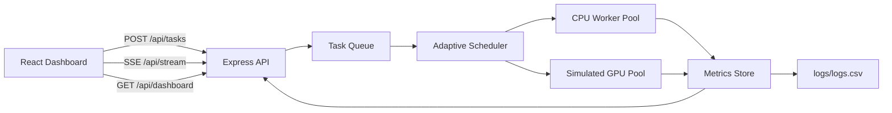

# AstraCompute: Intelligent CPU-GPU Hybrid Scheduler

AstraCompute is a production-ready local system for experimenting with adaptive task routing across a real CPU worker pool and a simulated GPU execution lane. It accepts vector and matrix workloads, learns from prior executions, logs metrics to CSV, and renders live system activity through a robotics-inspired dashboard tuned for macOS Apple Silicon.

## Overview

- Backend: Express + TypeScript API with a task queue, adaptive scheduler, SSE telemetry, and CSV logging
- Persistence: SQLite-backed task state, execution history, queue pause/resume state, and restart recovery
- Core engine: shared scheduler policies, task models, deterministic math kernels, and worker runtime contracts
- Frontend: React + Vite + TailwindCSS + Framer Motion + Recharts dashboard
- Deployment: Docker Compose with separate backend and frontend containers

## Architecture



## Project Structure

```text
smart-scheduler/
├── backend/
├── core-engine/
├── dashboard/
├── docker/
├── frontend/
├── logs/
└── README.md
```

## Mac M1/M2 Setup

Tested for Apple Silicon-friendly local development with Node.js 20+ and npm 10+.

1. Install Node.js 20 or newer.
2. From `/Users/amrutha/DimensionProjects/AstraCompute`, run `npm install`.
3. Start the stack with `npm run dev`.
4. Open `http://localhost:5173`.
5. Sign in with the seeded local operator:
   `demo@astracompute.local`
   `AstraDemo123!`

The backend defaults to port `4000`, and the frontend Vite dev server defaults to `5173`. In development, Vite proxies `/api` to the backend, so the browser and production build use the same API path shape.

## Local Run

```bash
npm install
npm run dev
```

Useful commands:

- `npm run build`
- `npm run test`
- `npm --workspace backend run start`

## Docker Run

```bash
docker compose up --build
```

Services:

- Frontend: `http://localhost:8080`
- Backend API: `http://localhost:4000`

The Docker frontend container proxies `/api` traffic to the backend container, including the live SSE stream, so the deployed app works behind a single public origin by default.

## Deployment Notes

- Frontend production builds now default to same-origin `/api`, so you do not need to hardcode `localhost` in deployment.
- If you deploy frontend and backend on different domains, set `VITE_API_URL` at frontend build time to the full backend API URL, for example `https://api.your-domain.com/api`.
- Set `FRONTEND_ORIGIN` on the backend to the public frontend origin. Multiple allowed origins can be provided as a comma-separated list.
- Persist the `logs/` directory in deployment so SQLite and CSV logs survive restarts.
- If you deploy behind a reverse proxy, make sure it supports long-lived connections for `/api/stream`.

## API Summary

- `POST /api/tasks` submit a task
- `GET /api/tasks` list tasks
- `GET /api/tasks/:id` fetch one task
- `POST /api/tasks/:id/cancel` cancel a queued task
- `POST /api/tasks/:id/retry` retry a completed, failed, or canceled task
- `POST /api/queue/pause` pause dispatch while allowing running tasks to finish
- `POST /api/queue/resume` resume dispatch
- `POST /api/system/reset-history` clear persisted tasks, decision traces, benchmark snapshots, and CSV log history
- `GET /api/metrics` fetch aggregate metrics
- `GET /api/benchmarks` fetch scheduler win rate, speedup, and executor benchmark summaries
- `GET /api/benchmarks/snapshots` list saved benchmark snapshots
- `POST /api/benchmarks/snapshots` persist the current benchmark view as a named snapshot
- `GET /api/tasks/:id/decision` fetch the persisted routing trace for one task
- `GET /api/policy` fetch the active scheduler policy
- `POST /api/policy` update the scheduler policy (`balanced`, `latency`, `throughput`, `cpu_preferred`)
- `GET /api/policy/governance` fetch policy lock state
- `POST /api/policy/lock` lock or unlock policy changes for the workspace
- `GET /api/executors` inspect current executor capacity and readiness
- `GET /api/dashboard` fetch dashboard-ready payload
- `GET /api/stream` stream live task and metrics events
- `POST /api/tasks/seed` enqueue demo workloads

## Benchmarks And Scheduling Logic

The scheduler starts with sane heuristics:

- small tasks prefer CPU
- large tasks prefer GPU
- higher priority tasks get pulled to the front of the queue

After execution, AstraCompute stores average durations by task type, size bucket, and executor. Future routing decisions compare those averages and can override the heuristic when historical data shows a better executor for that workload class.

Simulated GPU execution includes:

- fixed dispatch overhead
- higher throughput for large workloads
- the same deterministic computation kernel for correct results

This makes the simulated GPU slower for tiny tasks and faster for large tasks, which mirrors the behavior of many real heterogeneous systems.

Policy modes:

- `balanced`: mix heuristics with learned performance
- `latency`: choose the lowest estimated completion time
- `throughput`: bias toward GPU throughput when competitive
- `cpu_preferred`: keep work on CPU unless GPU shows a strong win

## Dashboard

The dashboard focuses on a robotics control-panel feel with:

- gradient-rich dark surfaces
- focused product pages for Overview, Jobs, Benchmarks, Policies, and System
- local operator sign in / sign up flow
- CPU vs GPU performance charts
- scheduler explainability inspector
- benchmark cards and size-band analysis
- benchmark archive snapshots
- executor readiness and capacity panels
- policy governance controls
- system verification workflow and reset-history controls
- toast-style operator feedback for key actions

Screenshot placeholder:


## Testing

Automated tests cover:

- scheduler route selection
- adaptive metrics updates
- queue ordering and lifecycle transitions

Run them with:

```bash
npm run test
```

## Logs

Execution data is appended to [`logs/logs.csv`](/Users/amrutha/DimensionProjects/AstraCompute/logs/logs.csv) with:

```text
task_id,executor,time_ms,status,task_type,size,priority,started_at,completed_at
```

Persistent task and queue state is stored in SQLite at `logs/astra.db` by default. On restart, queued tasks are restored and previously running tasks are safely re-queued.

If you want a clean local demo slate without deleting files manually, open the `System` page in the UI and use `Clear History`. That clears persisted workload, benchmark, and log history while keeping your account and scheduler policy settings.

## Future Extension Points

- Replace the simulated GPU executor with Metal or WebGPU
- Add persistent database storage for historical learning
- Introduce additional kernels such as reductions or convolutions
