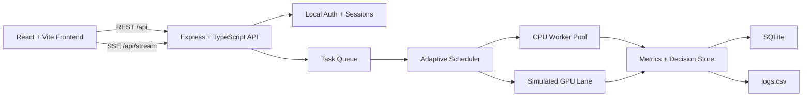

# AstraCompute

Intelligent CPU-GPU hybrid scheduling for numerical workloads on Apple Silicon.

AstraCompute is a full-stack systems project that routes compute-heavy tasks across a parallel CPU worker pool and a simulated GPU execution lane, learns from historical performance, and exposes live system behavior through a multi-page control dashboard. It was designed as a production-minded demonstration of systems engineering, backend orchestration, performance-aware scheduling, and modern frontend product design.

## Live Links

- Live Demo: `ADD_YOUR_FRONTEND_RENDER_URL_HERE`
- Backend API: [https://astracompute-backend.onrender.com](https://astracompute-backend.onrender.com)
- Repository: [https://github.com/Amrutha-space/AstraCompute](https://github.com/Amrutha-space/AstraCompute)

Once your frontend deploy is live, replace `ADD_YOUR_FRONTEND_RENDER_URL_HERE` with your Render static site URL.

## Why This Project Stands Out

- Built as a real monorepo with a shared core engine, backend service, and product-style frontend
- Uses adaptive scheduling logic instead of static routing rules alone
- Executes CPU workloads in parallel with worker threads
- Preserves task, benchmark, and policy state with SQLite persistence
- Streams live telemetry to the UI with server-sent events
- Includes operator workflows such as auth, queue control, retries, benchmarks, policy governance, and system checks

## Product Overview

AstraCompute accepts vector and matrix workloads, scores them against scheduling heuristics and historical timings, dispatches them to the most appropriate execution lane, and visualizes the result in real time.

The system is intentionally split into focused product surfaces instead of one overloaded dashboard:

- `Home`: branded entry experience and product framing
- `Access`: sign up and sign in flow for local operators
- `Overview`: live system summary and queue health
- `Jobs`: task submission, queue inspection, lifecycle actions
- `Benchmarks`: CPU vs GPU performance analysis and historical snapshots
- `Policies`: scheduler mode selection and governance controls
- `System`: readiness checks, demo load, and operational reset tools

## Architecture



## Core Technical Features

- Parallel CPU execution for vector addition and matrix multiplication
- Simulated GPU lane with pluggable abstraction for future Metal or WebGPU support
- Adaptive scheduler that combines heuristics with historical execution timings
- Policy modes: `balanced`, `latency`, `throughput`, `cpu_preferred`
- Task lifecycle controls: submit, cancel, retry, pause queue, resume queue
- Decision-trace persistence for explainability
- Benchmark snapshots and policy comparison
- Local authentication with sign up, sign in, and session restore
- SQLite-backed restart recovery and historical state retention

## Tech Stack

- Frontend: React, Vite, TypeScript, TailwindCSS, Framer Motion, Recharts
- Backend: Node.js, Express, TypeScript
- Core engine: shared scheduler, task models, kernels, execution contracts
- Persistence: SQLite and CSV logging
- Deployment: Render static site + Render web service

## Monorepo Structure

```text
AstraCompute/
├── backend/        # Express API, queue orchestration, auth, persistence
├── core-engine/    # Shared scheduler logic, task models, execution contracts
├── dashboard/      # Visual assets and screenshots
├── docker/         # Nginx and container deployment assets
├── frontend/       # React application and product UI
├── logs/           # SQLite database and CSV execution logs
└── README.md
```

## Scheduler Behavior

The scheduler begins with heuristics that match real heterogeneous compute tradeoffs:

- small workloads generally stay on CPU
- larger workloads are candidates for the GPU lane
- higher-priority tasks move earlier in the queue

After tasks finish, AstraCompute stores timing history by workload class, size bucket, and executor. Future decisions can override the initial heuristic when measured data suggests a better choice. This creates a scheduler that is both explainable and adaptive.

## Local Development

### Requirements

- Node.js 20+
- npm 10+
- macOS Apple Silicon recommended, though the stack is standard Node/React

### Run Locally

```bash
npm install
npm run dev
```

Open [http://localhost:5173](http://localhost:5173)

Demo operator credentials:

- Email: `demo@astracompute.local`
- Password: `AstraDemo123!`

Useful commands:

```bash
npm run test
npm run build
npm --workspace backend run start
```

## Deployment

### Recommended Hosting

- Frontend: Render Static Site
- Backend: Render Web Service

### Frontend Environment Variable

```bash
VITE_API_URL=https://your-backend-url.onrender.com/api
```

### Backend Environment Variables

```bash
NODE_VERSION=20
PORT=10000
DB_FILE=/tmp/astra.db
LOG_FILE=/tmp/logs.csv
FRONTEND_ORIGIN=https://your-frontend-url.onrender.com
```

Notes:

- `/tmp` works for free hosting and demos, but data is ephemeral across redeploys
- for durable persistence, migrate from SQLite-on-disk to a hosted Postgres service
- the frontend production build defaults to same-origin `/api` when no override is set

## API Highlights

- `POST /api/auth/signup`
- `POST /api/auth/login`
- `GET /api/auth/me`
- `GET /api/dashboard`
- `POST /api/tasks`
- `POST /api/tasks/seed`
- `POST /api/tasks/:id/cancel`
- `POST /api/tasks/:id/retry`
- `GET /api/benchmarks`
- `POST /api/benchmarks/snapshots`
- `POST /api/policy`
- `POST /api/policy/lock`
- `GET /api/executors`
- `POST /api/system/reset-history`
- `GET /api/stream`

## Testing And Validation

Automated coverage includes:

- scheduler policy selection
- adaptive metrics updates
- task lifecycle behavior
- persistence and restart recovery
- authentication flows

Run:

```bash
npm run test
```

## Dashboard Preview

Add a real product screenshot here once you capture your deployed UI:


## Engineering Notes

This project was built to demonstrate:

- systems design thinking
- concurrent execution patterns
- performance-aware backend logic
- product-minded frontend architecture
- operational visibility through metrics, benchmarks, and explainability

It is especially strong as a portfolio project because it combines low-level execution concerns with a polished operator-facing interface instead of stopping at algorithm demos or static dashboards.

## What I Would Build Next

- Replace the simulated GPU lane with Metal or WebGPU on macOS
- Move persistence to Postgres for free-tier durable cloud deployment
- Add richer job types and input-file workflows
- Add tenant-aware auth and role-based access
- Add benchmark export and shareable reports
